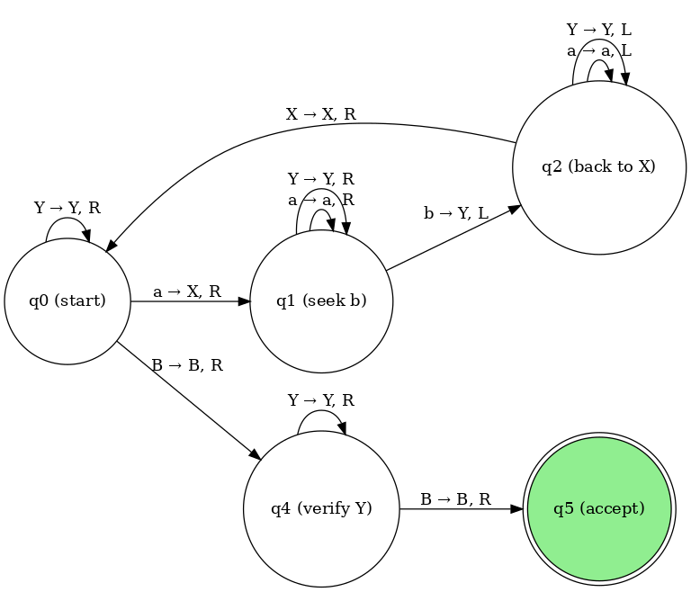
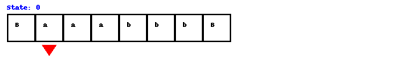

# 🧠 Turing Machine Simulator: Recognizing aⁿbⁿ

This project implements a simple **Turing Machine simulator in Python** that accepts strings of the form `aⁿbⁿ`, where the number of `a`s is equal to the number of `b`s and all `a`s come before any `b`s.

## 🔧 How It Works

The Turing Machine:

1. Scans for an unmarked `'a'`, replaces it with `'X'`.
2. Scans right to find the next `'b'`, replaces it with `'Y'`.
3. Moves back to the start to repeat the process.
4. Verifies all characters are matched (`X`s and `Y`s only).
5. Accepts the string if no unprocessed symbols are found.

It’s a great educational tool to visualize how a basic Turing machine can be built to process simple formal languages and symbol pairing rules.

## 🚀 Features

- Accepts inputs like `ab`, `aabb`, `aaabbb`, etc.
- Rejects invalid sequences like `aab`, `abb`, `ba`, `aaaabbbb`.
- Visual simulation using an **animated GIF** of tape and head movement.
- Generates a **state diagram** showing the Turing Machine logic.

## 📊 State Descriptions

| State | Purpose                                                     |
| ----- | ----------------------------------------------------------- |
| `q0`  | Find and mark the first `a` as `X`, move to `q1`            |
| `q1`  | Find the next unmatched `b`, mark it as `Y`, return in `q2` |
| `q2`  | Move back to the leftmost `X`, then go back to `q0`         |
| `q4`  | Final scan to confirm all symbols are matched               |
| `q5`  | Accepting state (halt)                                      |

## 🧪 Usage

Ensure Python 3 is installed. Run:

```bash
python turing.py
```

Then input a string like `aabb`, `aaaa`, `bbbb`, etc.

## 🖼 State Diagram



## 🖼 How it works



## 📄 License

MIT License — free to use, study, and modify.

**Happy Simulating!**🎉🎉🎉

Developed by KyloReneo.
